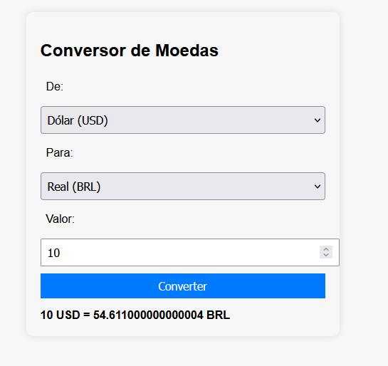
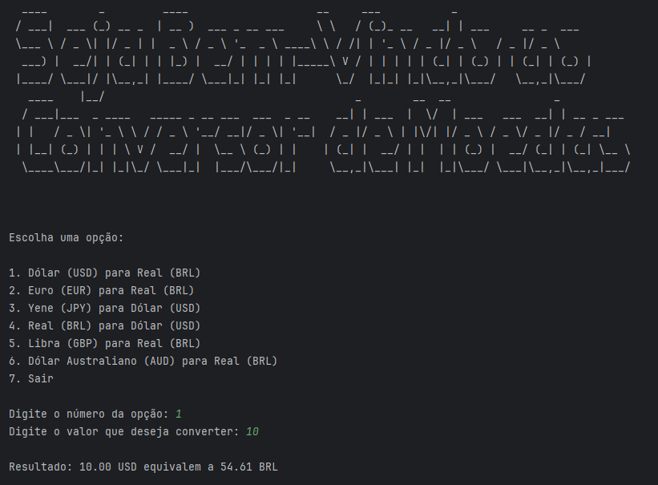

# Currency Converter

Um conversor de moedas com interface web simples e uma versão de terminal utilizando a Exchangerate API

## ✨ Funcionalidades

- Conversão entre diferentes moedas
- Interface gráfica simples e intuitiva
- Atualização automática das taxas de câmbio em tempo real via API

## 🚀 Tecnologias Utilizadas

Este projeto foi desenvolvido com as seguintes tecnologias:

- **Java 21** — Linguagem principal do backend
- **Spring Boot** — Framework para criação da API REST
- **Maven** — Gerenciador de dependências e build
- **Gson** — Biblioteca para manipulação de JSON
- **java-dotenv** — Biblioteca para leitura de variáveis de ambiente do arquivo `.env`
- **HTML, CSS, JavaScript** — Para a interface web

## 🚧 Deploy

    > Esta seção está em construção. Deploy está indisponivel no momento.

## 📷 Captura de Tela

Abaixo estão algumas imagens do aplicativo em funcionamento:

_Interface web do conversor de moedas._

_Versão de terminal do conversor de moedas._

## Licença 📜

Este projeto está licenciado sob a [MIT License.](./LICENSE).
